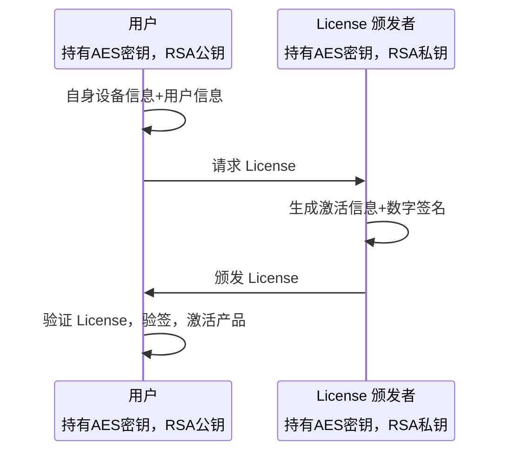
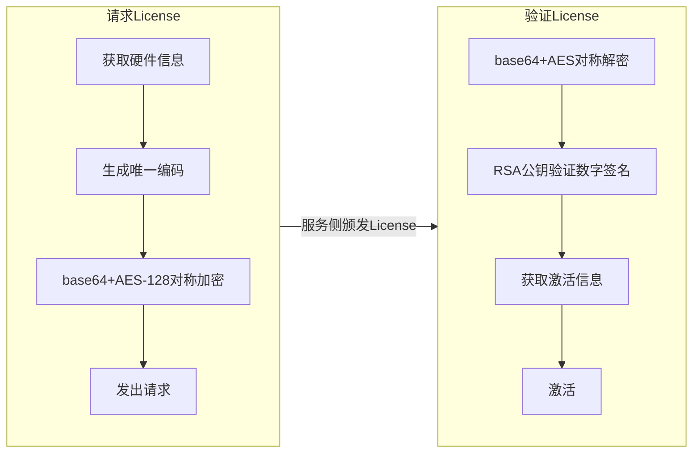
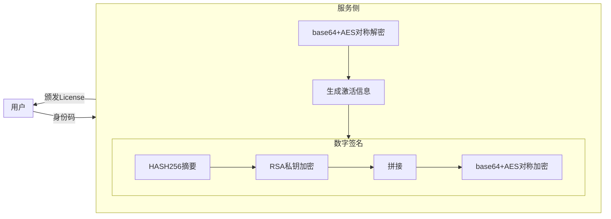

# 基于 python 的简单 license 系统.

恰好学习一些密码学知识。

## 依赖

|     pip      | 23.2.1 |
| :----------: | :----: |
| pycryptodome | 3.21.0 |
|     WMI      | 1.5.1  |
|   pywin32    |  308   |

## 架构

### 用户侧

### 颁发者

